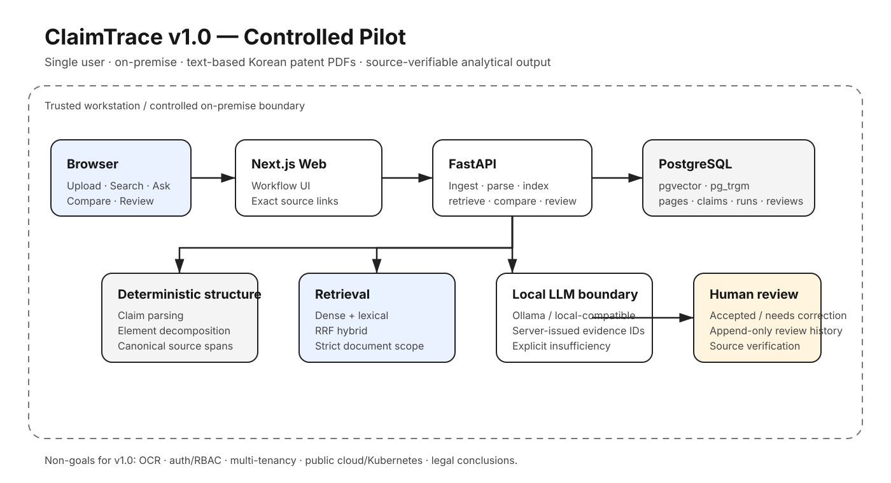
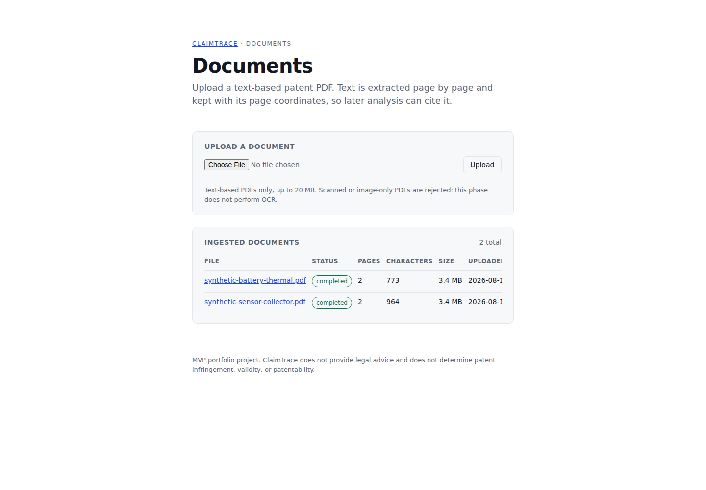
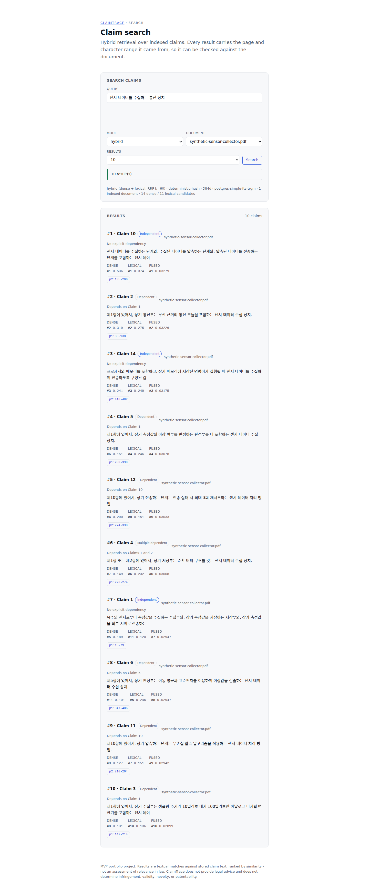
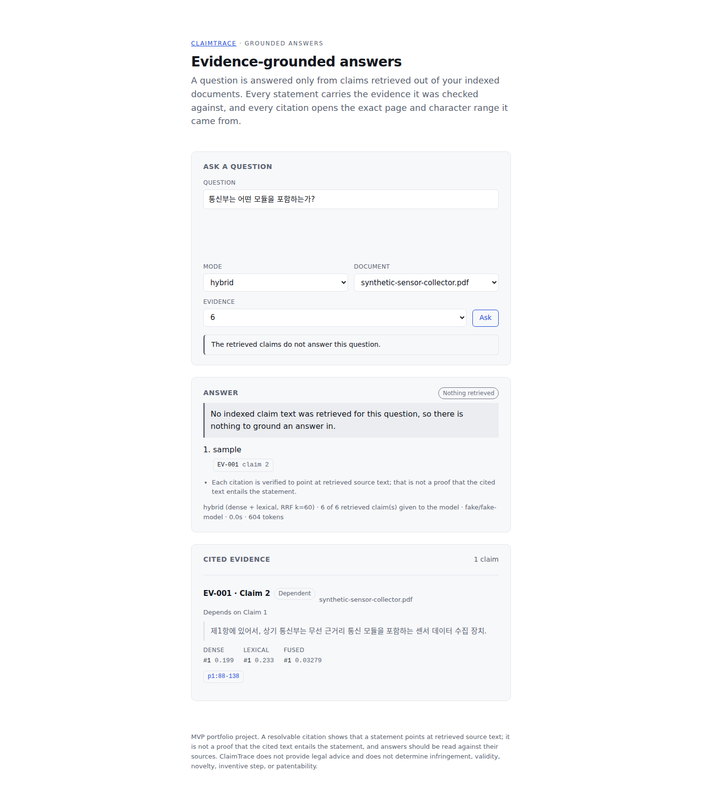
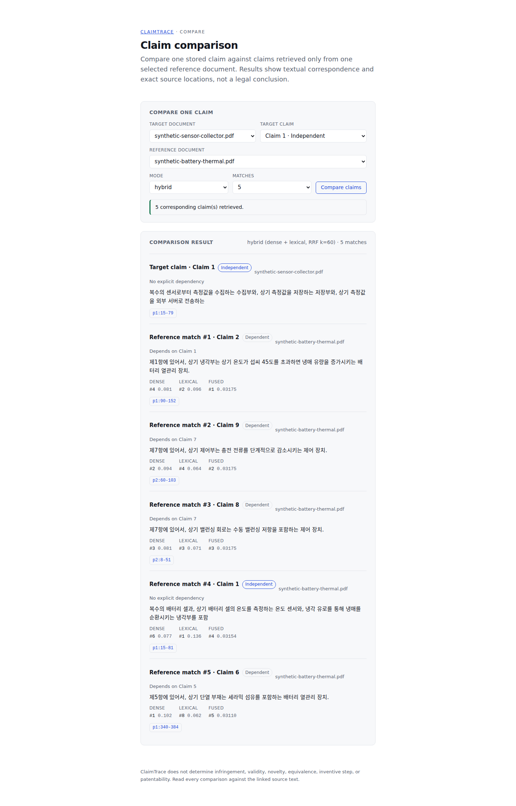
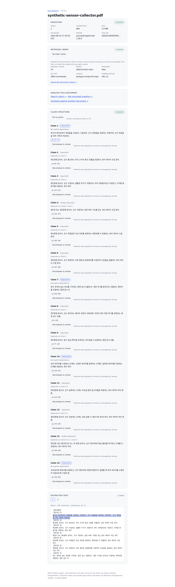
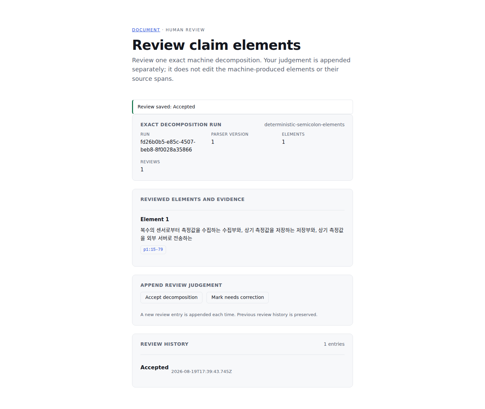

# ClaimTrace

**Source-verifiable patent claim analysis for a controlled on-premise workflow.**

ClaimTrace is a single-user pilot for text-based Korean patent PDFs. It ingests documents, preserves page-level provenance, parses and indexes claims, retrieves related evidence, produces evidence-grounded answers, compares claims across documents, decomposes claims into reviewable elements, and stores human review separately from machine output.

The product is deliberately bounded: **ClaimTrace does not provide legal advice and does not determine infringement, validity, novelty, equivalence, inventive step, or patentability.**



## Why this exists

Patent-analysis tooling is only useful when a reviewer can verify where an analytical statement came from. ClaimTrace treats source provenance as a first-class constraint rather than a UI afterthought.

Every supported analytical surface is designed around a canonical locator:

`document_id → page_number → start_char → end_char`

That locator is persisted with document text and reused by claim parsing, retrieval, grounded Q&A, comparison, decomposition, and review. The model is not allowed to invent page numbers or arbitrary citations: grounded generation selects from server-issued evidence identifiers that the server resolves back to stored source spans.

## What the v1.0 controlled pilot can do

1. Upload a text-based Korean patent PDF.
2. Validate, store, and extract page text.
3. Parse claim structure and dependencies.
4. Jump from a claim to its exact source span.
5. Index claims for dense, lexical, or hybrid retrieval.
6. Search and open any result at the persisted source range.
7. Ask an evidence-grounded question and receive cited statements or explicit insufficient evidence.
8. Select a target and reference document and compare a target claim under strict reference-document scope.
9. Decompose a claim into source-backed elements.
10. Record human review as `accepted` or `needs_correction` without overwriting machine output.
11. Navigate review output back to the original highlighted source text.

The frozen workflow is:

`ingest → parse → index → retrieve → ask → compare → decompose → review → verify source evidence`

## Product proof

The following assets are generated from the deterministic whole-product runtime used by the repository verification path, not hand-authored mockups.

### Documents and persisted corpus



### Hybrid retrieval with exact source links



### Evidence-grounded answer



### Bounded claim comparison



### Exact source verification



### Persisted human review



A concise recorded golden-path run is committed at [`docs/proof/demo/claimtrace-golden-path.webm`](docs/proof/demo/claimtrace-golden-path.webm).

## Executed evidence

These numbers come from executed GitHub-visible verification recorded in [`CLAIMTRACE_V1_MASTER.md`](CLAIMTRACE_V1_MASTER.md). They are proof of the current pipeline and repository state, not claims about general patent-analysis accuracy.

### Operational verification

- clean checkout + empty database migration: **GREEN**;
- Alembic `0001 → 0006 (head)` from an empty PostgreSQL database: **PASS**;
- deterministic whole-product browser golden path: **PASS**;
- backend database-free tier: **785 PASS**;
- PostgreSQL integration tier: **135 PASS / 0 skipped**;
- Ruff lint/format and frontend ESLint/TypeScript: **GREEN**;
- expected failure-state verification: **5 PASS**.

### Retrieval evaluation

Synthetic regression corpus: **26 claims / 19 queries**.

| Mode | Recall@1 | Recall@3 | Recall@5 | MRR@10 |
| --- | ---: | ---: | ---: | ---: |
| Dense | 0.7696 | 0.9265 | 0.9706 | 0.9608 |
| Lexical | 0.7402 | 0.8971 | 0.9118 | 0.9608 |
| Hybrid RRF | 0.7990 | 0.9265 | 0.9412 | 1.0000 |

This is a small synthetic regression set for reproducibility and ranking regressions, **not a benchmark-quality claim about patent retrieval**.

### Grounded deterministic evaluation

16 committed cases:

- structured output: `1.000`;
- answerability: `1.000`;
- insufficient-evidence precision / recall: `1.000 / 1.000`;
- citation resolution: `1.000`;
- statement citation coverage: `1.000`;
- evidence-ID validity: `1.000`;
- evidence selection precision / recall: `1.000 / 0.9167`;
- end-to-end success: `0.9375`;
- forbidden cross-document citations: `0`;
- hostile grounding payloads refused: **6 / 6**.

The known weak case `g01-single-storage` remains visible: retrieval did not supply the required labelled claim, so end-to-end success is intentionally not represented as `1.000`.

## Architecture

ClaimTrace runs inside a trusted workstation or controlled on-premise boundary:

```text
Browser
  ↓
Next.js Web
  ↓ HTTP
FastAPI
  ├─ document ingestion + canonical page/source persistence
  ├─ deterministic claim parsing + element decomposition
  ├─ dense / lexical / RRF retrieval
  ├─ local/self-hosted LLM provider boundary
  ├─ bounded claim comparison
  └─ append-only human review state
  ↓
PostgreSQL 17 + pgvector + pg_trgm
```

Detailed design and historical extension points live in [`docs/ARCHITECTURE.md`](docs/ARCHITECTURE.md). The proof-facing architecture visual above is the current v1.0 boundary.

## Reproduce the controlled pilot

### Prerequisites

- Docker Engine / Docker Desktop with Compose v2
- Node.js 22+ for browser proof capture

### Start the application

```bash
cp .env.example .env

docker compose up --build -d postgres
docker compose run --rm api alembic upgrade head
docker compose up -d api web
```

Default surfaces:

- Web: `http://localhost:3000`
- Documents: `http://localhost:3000/documents`
- Search: `http://localhost:3000/search`
- Grounded Q&A: `http://localhost:3000/grounded`
- Compare: `http://localhost:3000/compare`
- API: `http://localhost:8000`
- API docs: `http://localhost:8000/docs`

### Re-run the deterministic proof capture

Install the browser runner in `apps/web`, then execute:

```bash
cd apps/web
npm ci
npm install --no-save --package-lock=false playwright@1.55.0
npx playwright install chromium
cd ../..

sh scripts/capture-v1-07-proof.sh
```

The capture uses the committed deterministic two-document seed, fake embedding provider, and fake LLM provider so it does not depend on a hosted model service.

## Technology

| Layer | Choice |
| --- | --- |
| Backend | Python 3.12, FastAPI, Pydantic v2, SQLAlchemy 2.x async, Alembic, psycopg 3, PyMuPDF |
| Database | PostgreSQL 17, pgvector, pg_trgm |
| Retrieval | multilingual embeddings, PostgreSQL lexical retrieval, Reciprocal Rank Fusion |
| Frontend | Next.js App Router, React, TypeScript |
| LLM boundary | Ollama, OpenAI-compatible local server, deterministic fake provider |
| Verification | pytest, Ruff, ESLint, TypeScript, Playwright, Docker Compose, GitHub Actions |

## Known limitations

- **Text-based PDFs only.** OCR and scanned/image-only PDF recovery are deliberately unsupported in v1.0 and fail explicitly.
- Korean claim parsing is deterministic and intentionally bounded; it is not represented as a universal patent parser.
- Citation resolvability proves that a statement points to stored evidence; **it does not prove semantic entailment or legal correctness**.
- Retrieval and grounded metrics above use committed synthetic corpora intended for regression verification.
- The V1-07 GitHub-hosted evaluation could not access a local Ollama endpoint. The historical `qwen2.5:1.5b` run remains historical only; **real-local-model quality was not rerun for the current V1-07 proof tier**.
- No authentication, RBAC, multi-tenancy, public-cloud deployment, Kubernetes, billing, or admin console is part of this controlled pilot.
- Human review is an explicit product boundary. Machine decomposition is not silently promoted to reviewer judgement.

## Repository map

```text
claim-trace/
├── apps/api/                 FastAPI, migrations, tests, evaluations
├── apps/web/                 Next.js UI and browser verification
├── docs/proof/               proof architecture, screenshots, demo asset
├── docs/ARCHITECTURE.md      detailed internal architecture
├── docs/ROADMAP.md           post-v1 possibilities
├── infra/                    PostgreSQL initialization
├── scripts/                  reproducible verification/capture runners
├── .github/workflows/        PR-visible CI and acceptance workflows
├── CLAIMTRACE_V1_MASTER.md   authoritative v1.0 execution/evidence ledger
└── docker-compose.yml        local controlled-pilot runtime
```

## Status

ClaimTrace v1.0 controlled-pilot implementation, deterministic validation, proof packaging, and final Human Review are complete. The reviewed Proof is **`CLAIMTRACE PROOF v1.0 CLOSED / FREEZE — HUMAN REVIEW PASSED`**. Remote annotated tag `v1.0-proof` is verified to dereference to reviewed commit `bcb37b1a86ae70e2f35cdab6708da9310d7e9e2d`.

The repository remains frozen at the documented v1.0 Proof boundary; later documentation-only closure reconciliation does not alter the tagged product/runtime state.

For the authoritative current state, exact workflow evidence, limitations, and closure decision, read [`CLAIMTRACE_V1_MASTER.md`](CLAIMTRACE_V1_MASTER.md).

---

MIT License. See [`LICENSE`](LICENSE).